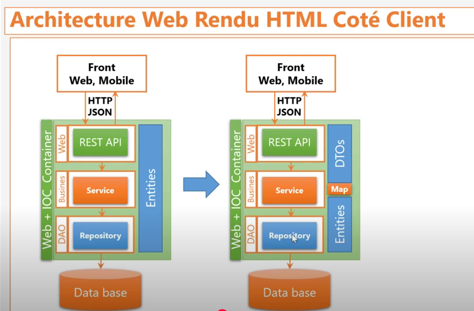
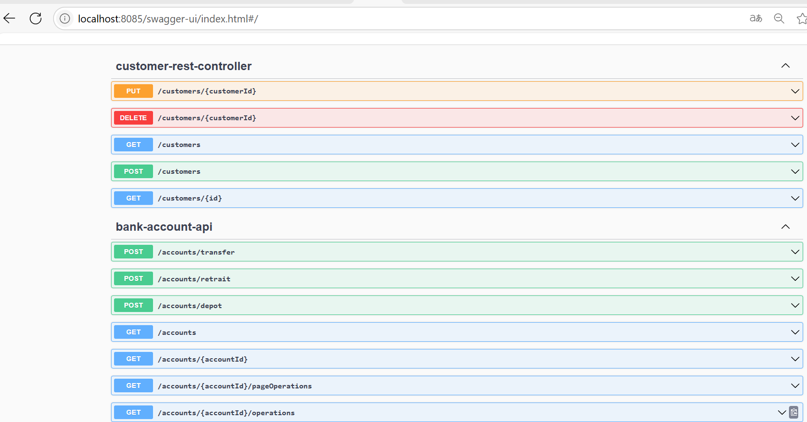
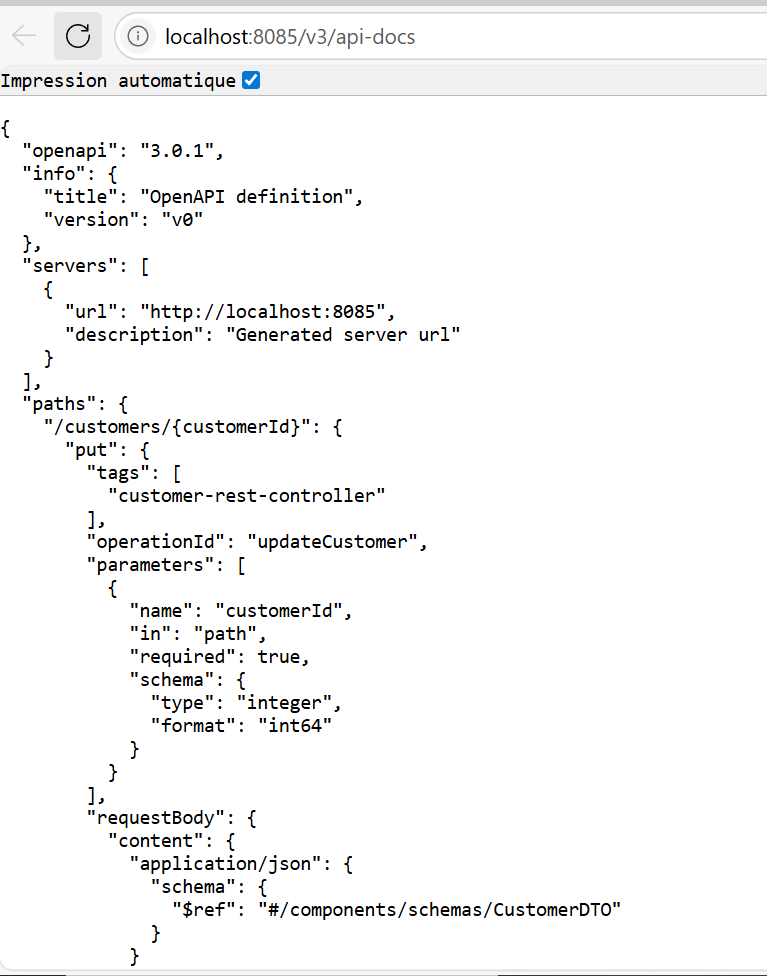
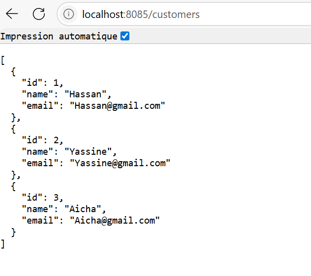
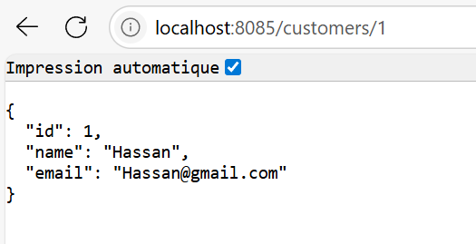
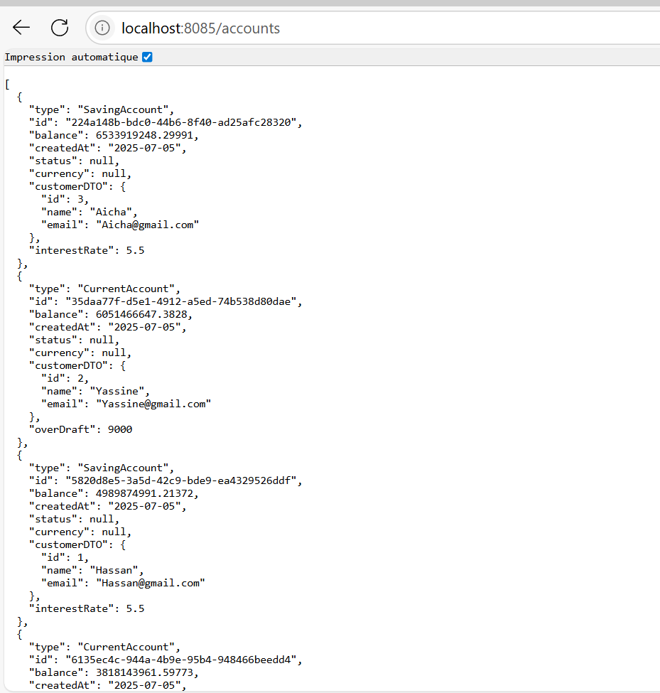
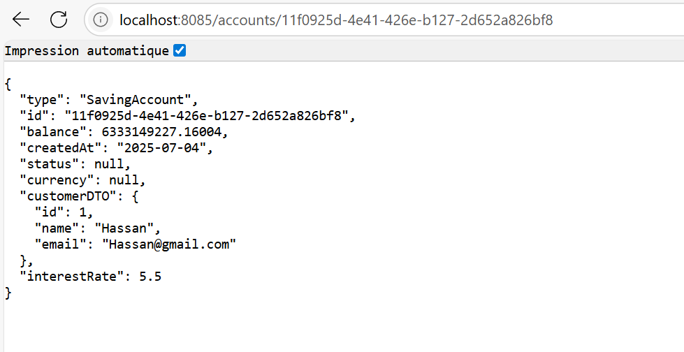
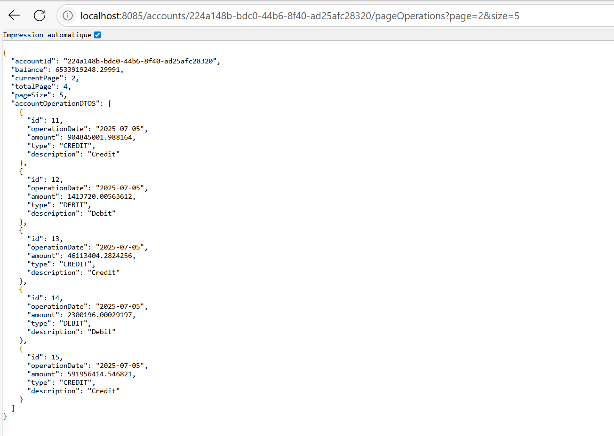

<h1> Projet J2EE Spring : Application web rendue HTML côté client </h1>

<h2>Documentation swagger du REST Controller du back-end </h2> 

<h2>Quelques test de l'API </h2>
<h3>Liste des clients </h3>

<h3>Client dont id=1 </h3>

<h3>Liste des comptes</h3>

<h3> un Compte </h3>

<h3> un compte avec la liste des opérations paginées </h3>
